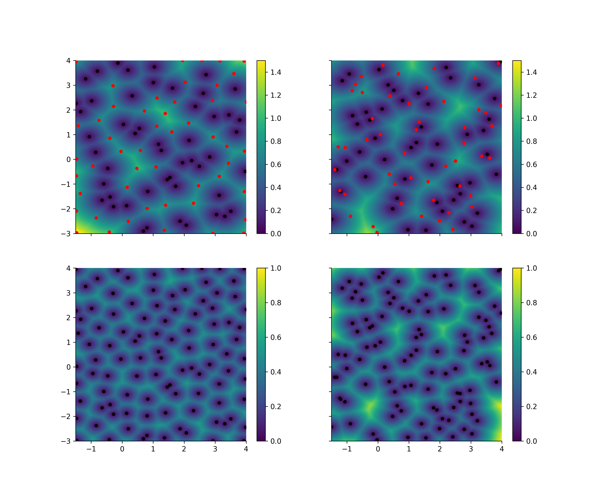

# ModelXplore, a python based model exploration

ModelXplore is an helper library that give some tool to facilitate the
exploration of time-expansive models (or experimentation).

It give access to a variety of samplers, of regression function (called
meta-model), easy access to sensitivity analysis, and make easy the
computation of response surface.

## Installation

During the alpha phase (v0.1.0), the software is obviously not
production ready. Thus, it is installable via the github repository :

```bash
pip install git+git://github.com/locie/modelxplore
```

Dependencies should be up-to-date. If not, or if something went wrong,
feel free to open an issue : the bug will be fixed asap.

In order to reproduce the notebook examples, you will need holoviews as
well:

```bash
pip install holoviews
```

## Overview

If we take the ishigami function, we know what it looks like ;


But what if we have a function that is really expansive, and you want to
obtain that kind of surface response?

```python
>>> from modelxplore import Explorer, get_test_function
>>> ishigami = get_test_function("ishigami")()

# We create the explorer with the bounds of the problem and the function.
>>> expl = Explorer(ishigami.bounds, ishigami)

# We generate 150 samples, and generate the outputs.
>>> new_samples = expl.explore(150)

# We let the autotuner chose a well-suited metamodel on the 2 most sensitive
# inputs

>>> metamodel = expl.select_metamodel(features=2)

# We compute, then plot the surface response of the obtained metamodel
>>> response = metamodel.response(50)
>>> response.plot()  # doctest: +SKIP

# We run a sobol sensitivity analysis on the metamodel (first and second order)
>>> print(expl.metamodel.full_sensitivity_analysis())  # doctest: +SKIP

```

You will then obtain an overview of your model with only 150 run,
through a metamodel.


## In detail

### Explorer

The explorer class is the main class, the one the user will manipulate
the most.

It takes at initialization the bounds of the problem (as a list of
`[(var: (down limit, up limit))]`), and can take a function
that will have as signature `(*inputs)->output`.

```python
# An explorer without attached model
>>> explorer = Explorer([("x1", (0, 1)), ("x2", (-5, 5))])

```

```python
# An explorer with attached model

>>> def my_model(x1, x2):
...     return np.cos(x1) * np.cos(x2)

>>> explorer = Explorer([("x1", (0, 1)), ("x2", (-5, 5))], my_model)

```

The explorer can generate new samples (according to the attached
sampler) at user will, and if a function has been provided, can compute
the ouput for these samples.

```python
>>> def my_model(x1, x2):
...     return np.cos(x1) * np.cos(x2)

>>> explorer = Explorer([("x1", (0, 1)), ("x2", (-5, 5))], my_model)

# generate samples (without running the model) according to the sampler "lhs" (default)
>>> new_samples = explorer.sample(200)

# generate samples, generate outputs, and attach them to the explorer
>>> new_samples = explorer.explore(200)

# These samples are available as a dataframe with
>>> df = explorer.data

# Use user provided samples, run the model on it, attach them
>>> new_samples = explorer.explore(X=X)

# Use user provided samples and output, attach them
# (Only way to use "explore" without providing a model)
>>> new_samples = explorer.explore(X=X, y=y)

```

A sensitivity analysis is available (via the RBD-fast method), which
give access to the first order sensitivity indices. They are used to
order inputs according to their relative importance.

```python
>>> def my_model(x1, x2):
...     return np.cos(x1) * np.cos(x2)
>>> explorer = Explorer([("x1", (0, 1)), ("x2", (-5, 5))], my_model)
>>> new_samples = explorer.explore(200)
>>> sensitivity_indices = explorer.sensitivity_analysis()

```

The method `explorer.select_metamodel` allow to attach a
metamodel to the explorer. This one can be automaticaly selected (tuned)
via the library optunity, accross some or all inputs.

```python

# full auto tune, let optunity chose as well metamodel and hyperparameters and
# use the default threshold to select the relevant features (via the sensitivity indices) :
# the N most relevant features will be used, in order to have 90% of the variance explained
# by these features
>>> metamodel = explorer.select_metamodel()

# We can lower the threshold
>>> metamodel = explorer.select_metamodel("k-nn", threshold=.8)  # doctest: +SKIP

# full auto tune, but select the N most relevant features
>>> metamodel = explorer.select_metamodel("k-nn", features=2)  # doctest: +SKIP

# full auto tune, but select specific features
>>> metamodel = explorer.select_metamodel("k-nn", features=["x1", "x3"])  # doctest: +SKIP

# auto tune on selected metamodel
>>> metamodel = explorer.select_metamodel(algorithm="svm")

# auto tune on list of algorithms
>>> metamodel = explorer.select_metamodel(algorithm=["svm", "k-nn"])

# auto tune off (you have to provide one algorithm in that case)
>>> metamodel = explorer.select_metamodel(algorithm="svm", hypopt=False)

# After that, we have access to that metamodel:
>>> metamodel = explorer.metamodel(x1=1, x2=0.5)

```

### Model

A model in an object that represent your model. It contains the bounds
of the problem, the function used to compute the output from the inputs.
It is also a callable, so you can use:

```python
>>> model = Model(bounds, function)
>>> y = model(X)

```

Main attributes and properties:

- `model.inputs` give you the inputs variables in the
   order expected by the function.
- `model.bounds` give you the problem bounds as a
   dictionnary.
- `model.S1` give you access to the first order
   sensitivity index, computed with the RBD-fast method.

Main methods:

- `model.response` compute the response surface. You can
   Compute the response surface on a grid. This grid can be *uniform* or
   use the sensitivity indices to spread the number of slice between
   the different dimensions.
- `model.sensitivity_analysis` compute the first order
   sensitivity analysis via the RBD-fast method.
- `model.full_sensitivity_analysis` compute the first and
   second order sensitivity analysis via the Sobol method.

#### Meta Model

The metamodels are models built on a sklearn regressor : they are
designed to be train on the user data (via the an explorer). It has an
extra `metamodel.fit` that is used to fit the metamodel,
and a *static* method `Metamodel.tune_metamodel` that use
[optunity](http://optunity.readthedocs.io/en/latest/) to chose an
optimal regressor and tune its hyperparameters.

### Sampler

The samplers are used to generate inputs in an optimal way. Two samplers
are available for now:

- *Latin hypercube Sampler*: designed to maximized the information
  with as few sample as possible, without being deterministic. This is
  often an optimal choice if you know how much run you will need, but
  not well suited for incremental exploration (run some samples,
  explore the results, run other sampled\...).
- *Incremental Sampler*: the first sampling use the LHS sampler, then
  every extra samples is chosen in order to fill the void.
- *Responsive Sampler*: a sampler that take into account the distance
  between older samples and the output gradient to favorize the exploration
  in interesting area.

#### Incremental sampler

The following figure illustrate the difference, with the *incremental
sampler* at the left, and the *lhs sampler* at the right. The first line
is the initial LHS sampling (50 samples) as black dots, and additionnal
sampling (50 samples) as red dot. The colormap represent the euclidian
distance between the point.



We can see that the incremental sampling is able to fill the void
between the olders sample when the lhs sampling is "amnesic" : the new
samples do not take the old ones into account.

#### Responsive sampler

The responsive sampler add to the advantages of an incremental sampler with a computation of the output gradient.

It will use a metamodel to map the output for gradient computation.


Thank to that magnitude map and the distance map already used into the incremental sampler, the new samples are generated close to the high gradient area.


We can see that the samples are nicely distributed near the high gradient.

Available samplers are listed with

```python
from modelxplore import available_samplers
print(available_samplers)
```

You can register a new sampler easily, and it will be usable directly
within an Explorer.

```python
>>> from modelxplore import Sampler, register_sampler
>>> from scipy.stats import uniform
>>> from sklearn.preprocessing import MinMaxScaler

>>> class MonteCarloSampler(Sampler):
...     name = "monte-carlo"
...
...     def rvs(self, size=1):
...         scalers = [MinMaxScaler(bound) for bound in self._bounds]
...         samples = uniform.rvs(size=(size, self.ndim))
...         samples = [scaler.fit_transform(sample[:, None]).T
...                    for scaler, sample
...                    in zip(scalers, samples.T)]
...         samples = np.vstack(samples).T
...
...         return samples

>>> register_sampler(MonteCarloSampler)
>>> explorer = mx.Explorer(bounds, function, sampler="monte-carlo")
>>> new_samples = explorer.explore(50)

```

### Tuner

A tuner is a combinaison of a sklearn regressor with a search space that
defined the bounds of the hyperparameters optimization.

The simplest one available is the k-nn tuner

```python
>>> class KnnTuner(Tuner):
...     name = "k-nn"
...     search = {'n_neighbors': [1, 5]}
...     Regressor = KNeighborsRegressor
```

The only hyperparameter to optimize is the `n_neighbors`,
which can go from 1 to 5.

A special tuner is the `MultipleTuner` that link different
tuners to search which one is the most efficient. This is what is used
when a user provide a list of algorithm when he selects a metamodel.

The hyperparameters type are detected automaticaly via the validator
library [voluptuous](https://github.com/alecthomas/voluptuous)
and the `Regressor` signature, but if a signature is a bit more complex, you can overide the
validator when you create your tuner. For example, for the (more
complex) `SVMTuner`:

```python
>>> class SVMTuner(Tuner):
...     name = "svm"
...     search = {'kernel': {'linear': {'C': [0, 2]},
...                         'rbf': {'gamma': [0, 1],
...                                 'C': [0, 10]},
...                         'poly': {'degree': [2, 5],
...                                   'C': [0, 50],
...                                   'coef0': [0, 1]}
...                         }
...               }
...     Regressor = SVR
...     override_validation = dict(degree=Coerce(float),
...                               gamma=Any('auto', Coerce(float)))

```

In that case, *degree* is detected as an integer instead of a float, and
*gamma* is set to **auto** by default. We had to override these default
value in order to let the Tuner know how to do the optimization.

you can register your own tuner the same way you register a Sampler:

```python
>>> from sklearn.gaussian_process import GaussianProcessRegressor
>>> class GaussianProcessTuner(Tuner):
...     name = "gaussian-process"
...     search = {"alpha": [1E-10, 1E-1]}
...     Regressor = GaussianProcessRegressor

>>> register_tuner(GaussianProcessTuner)

>>> explorer = Explorer(bounds, function)
>>> new_samples = explorer.explore(60)
>>> metamodel = explorer.select_metamodel("gaussian-process")
>>> response = metamodel.response(50)

```

## Gallery

### Ishigami


left to right : reference function, gaussian-process metamodel, svm
metamodel. Trained with 150 samples.

### Mc Cormick


left to right : reference function, gaussian-process metamodel,
random-forest metamodel. Trained with 150 samples.

### Sobol G


left to right : reference function, random-forest metamodel,
gaussian-process metamodel. Trained with 800 samples.

## TODO

- tests
- CI
- Add tuners
- Add test functions
