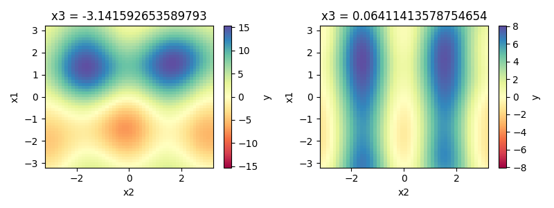

ModelXplore, a python based model exploration
=============================================

ModelXplore is an helper library that give some tool to facilitate the
exploration of time-expansive models (or experimentation).

It give access to a variety of samplers, of regression function
(called meta-model), easy access to sensitivity analysis, and make easy the
computation of response surface.

Installation
------------

During the alpha phase (v0.1.0), the software is obviously not production
ready. Thus, it is installable via the github repository :

.. code-block:: bash

  pip install git+git://github.com/locie/modelxplore

Dependencies should be up-to-date. If not, or if something went wrong, feel
free to open an issue : the bug will be fixed asap.

In order to reproduce the notebook examples, you will need holoviews as well:

.. code-block:: bash

  pip install holoviews

Overview
--------

If we take the ishigami function, we know what it looks like ;

But what if we have a function that is really expansive, and you want to
obtain that kind of surface response?

.. code-block:: python3

  from modelxplore import Explorer, get_test_function
  ishigami = get_test_function("ishigami")()

  # We create the explorer with the bounds of the problem and the function.
  expl = Explorer(bounds=ishigami.bounds, function=ishigami)

  # We generate 150 samples, and generate the outputs.
  expl.explore(150)

  # We let the autotuner chose a well-suited metamodel on the 2 most sensitive
  # inputs

  expl.select_metamodel(features=2)

  # We compute, then plot the surface response of the obtained metamodel
  response = expl.metamodel.response(50)
  response.plot()

  # We run a sobol sensitivity analysis on the metamodel (first and second order)
  print(expl.metamodel.full_sensitivity_analysis())

You will then obtain an overview of your model with only 150 run, through a
metamodel.

In detail
---------

Explorer
********

Model
*****

A model in an object that represent your model. It contains the bounds
of the problem, the function used to compute the output from the inputs.
It is also a callable, so you can use:

.. code-block:: python3

  model = Model(bounds, function)
  y = model(X)

Main attributes and properties:

- :code:`model.inputs` give you the inputs variables in the order expected
  by the function.
- :code:`model.bounds` give you the problem bounds as a dictionnary.
- :code:`model.S1` give you access to the first order sensitivity index,
  computed with the RBD-fast method.

Main methods:

- :code:`model.response` compute the response surface. You can use the
  *fast* or the *accurate* method : the first evaluate the model on
  sampled inputs, then use a Nearest Neighbour interpolation to project
  the output to the response grid. The latter compute the response surface
  directly on the grid. This grid can be *uniform* or use the sensitivity
  indices to spread the number of slice between the different dimensions.
- :code:`model.sensitivity_analysis` compute the first order sensitivity
  analysis via the RBD-fast method.
- :code:`model.full_sensitivity_analysis` compute the first and second
  order sensitivity analysis via the Sobol method.

Meta Model
^^^^^^^^^^

The metamodels are models built on a sklearn regressor : they are designed
to be train on the user data (via the an explorer). It has an extra
:code:`metamodel.fit` that is used to fit the metamodel, and a *static* method
:code:`Metamodel.tune_metamodel` that use
`optunity <http://optunity.readthedocs.io/en/latest/>`_ to chose an optimal
regressor and tune its hyperparameters.

Sampler
*******

The samplers are used to generate inputs in an optimal way. Two samplers
are available for now:

- *Latin hypercube Sampler*: designed to maximized the information with
  as few sample as possible, without being deterministic. This is often
  an optimal choice if you know how much run you will need, but not well
  suited for incremental exploration (run some samples, explore the results,
  run other sampled...).
- *Incremental Sampler*: the first sampling use the LHS sampler, then every
  extra samples is chosen in order to fill the void.
- *Responsive Sampler* (under consruction): a sampler that take into account
  the distance between older samples and the output gradient to favorize the
  exploration in interesting area (Comming soon).

The following figure illustrate the difference, with the *incremental sampler*
at the left, and the *lhs sampler* at the right. The first line is the initial
LHS sampling (50 samples) as black dots, and additionnal sampling (50 samples)
as red dot. The colormap represent the euclidian distance between the point.

.. image:: doc/incremental.png

We can see that the incremental sampling is able to fill the void between the
olders sample when the lhs sampling is "amnesic" : the new samples do not take
the old ones into account.

available samplers are available with

.. code-block:: python3

  from modelxplore import available_samplers
  print(available_samplers)

Tuner
*****

.. code-block:: python3

  from modelxplore import available_tuners
  print(available_tuners)
